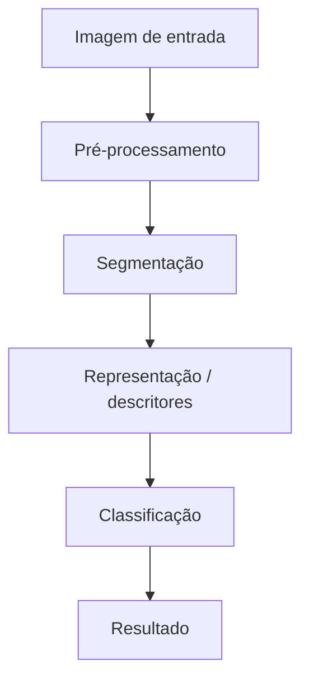

# Proposta do Projeto - Identificação e Contagem de Moedas

**Equipe:** Gabriel Maximiano dos Santos, Diego Augusto Carvalho, Seiki Takao Iizuka  
**Disciplina:** Processamento de Imagens  

---

## 1. Problema
A

---

## 2. Contexto de Aplicação
A

---

## 3. Objetivos


### 3.1 Objetivo Geral
Desenvolver um sistema computacional capaz de segmentar, identificar o valor nominal e contabilizar moedas
do Real em imagens digitais, informando o somatório dos valores.

### 3.2 Objetivos Específicos
- Segmentar as moedas separando-as do fundo da imagem (background);
- Isolar cada moeda (lidando, se possível, com casos de oclusão leve ou moedas muito próximas);
- Classificar o valor de cada moeda detectada;
- Calcular e exibir o montante final

---

## 4. Entrada e Saída Esperadas
- **Entrada:** Uma imagem digital contendo uma ou múltiplas moedas.
- **Saída:** Uma texto informando o total do montante detectado.

---

## 5. Critérios de Sucesso
A

---

## 6. Imagens
A

---

## 7. Pipeline Preliminar

### 7.1 Detalhamento das Etapas

1. A

---

## 8. Arquitetura preliminar
A

---

## 9. Estudo Inicial de Viabilidade
A

---

## 10. Uso de Inteligência Artificial Generativa
A
