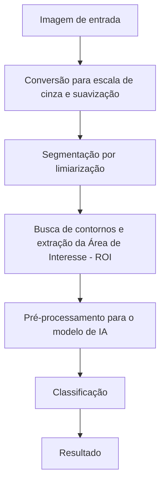

# Proposta do Projeto - Identificação e Contagem de Moedas

**Equipe:** Gabriel Maximiano dos Santos, Diego Augusto Carvalho, Seiki Takao Iizuka  
**Disciplina:** Processamento de Imagens  

---

## 1. Problema
A identificação e contagem manual de moedas em estabelecimentos comerciais ou no uso doméstico é uma atividade repetitiva, demorada e sujeita a erros, especialmente ao lidar com grandes volumes de moedas e na ausência de contadores digitais físicos.

Este projeto propõe investigar esse problema utilizando o processamento digital de imagens (PDI). A situação inicial consiste em uma foto contendo um conjunto de moedas (Real) espalhadas sobre uma superfície qualquer. A partir dessa imagem, deve-se produzir a localização (segmentação) de cada moeda, a classificação do seu respectivo valor e o somatório final.

---

## 2. Contexto de Aplicação
A solução é destinada principalmente a pequenos comerciantes que não possuem dispositivos específico para contagem de moedas, além do uso doméstico. Servirá como uma ferramenta de auxílio rápido, onde o usuário pode tirar uma foto das moedas e visualizar o valor total.

---

## 3. Objetivos

### 3.1 Objetivo Geral
Desenvolver um sistema computacional capaz de segmentar, identificar o valor nominal e contabilizar moedas
do Real em imagens digitais, informando o somatório dos valores.

### 3.2 Objetivos Específicos
- Segmentar as moedas separando-as do fundo da imagem (background);
- Isolar cada moeda (lidando, se possível, com casos de oclusão leve ou moedas muito próximas);
- Classificar o valor de cada moeda detectada;
- Calcular e exibir o montante final

---

## 4. Entrada e Saída Esperadas
- **Entrada:** Uma imagem digital contendo uma ou múltiplas moedas. Para o escopo do projeto, é assumido que todas as moedas presentes na imagem tenham a face "coroa" voltada para cima. além disso, o fundo deve ter uma neutralidade razoável que permita a segmentação e Identificação adequada. 
- **Saída:** Uma texto informando o total do montante detectado.

---

## 5. Critérios de Sucesso
- **Segmentação precisa:** O sistema precisa ser capaz de extrair corretamente a geometria das moedas, delimitando se certa região é uma moeda ou o fundo e, ao mesmo tempo, descartando ruídos e reflexos de fundo que possam interferir negativamente na segmentação. 
- **Precisão na classificação:** O modelo de rede neural deve ser capaz de identificar corretamente o valor das moedas através de sua tipografia, independentemente de sua rotação. 

## 6. Imagens
A

---

## 7. Pipeline Preliminar

### 7.1 Detalhamento das Etapas

1. **Conversão para escala de cinza e suavização**
Finalidade:Converter a imagem para uma escala de cinza para reduzir custo computacional e borrar a imagem para para suavizar os detalhes internos da moeda, o que vai ser útil para a segmentação.
Técnica: Para fazer a conversão para escalas de cinza, será usado a técnica de 'conversão de espaços de cores' através de 'cv2.cvtColor'. Para o filtro de suavização, será aplicado uma convolução gaussiana (cv2.GaussianBlur). 
Recebe: Imagem original colorida (BGR).
Produz: Matriz bidimensional em tons de cinza com suavização espacial. 
Principal dúvida: Ainda não sabemos o tamanho ideal da máscara/kernel de convolução gaussiana para aplicar na imagem sem prejudicar muito a nitidez das bordas.

2. **Segmentação por limiarização**
Finalidade: Separar matematicamente as moedas do fundo, binarizando a imagem. 
Técnica: Através do 'cv2.threshold', será utilizado o método de limiarização global usando o método de Otsu (cv2.THRESH_OTSU).
Recebe: Matriz bidimensional em tons de cinza com suavização espacial. 
Produz: Máscara binária que separa o fundo das moedas. 
Principal dúvida/Observação: uma vez que o cv2.findCountours apenas detecta objetos claros num fundo escuro, será feito uma análise dos pixels da borda pada deduzir qual a parte clara e qual a parte escura e, dependendo do caso, será usado o cv2.THRESH_BINARY_INV ou o cv2.THRESH_BINARY. Ainda estamos avaliando essa parte. 

3. **Busca de contornos e Extração da Área de interesse (ROI)**
Finalidade: Delimitar os limites espaciais de cada moeda na mascára binária e extrair o recorte de cada moeda. 
Técnica: É usado o algoritmo de suzuki (cv2.findCountours) para varrer a máscara para buscar fronteiras externas e fechadas. É usado o cv2.contourArea para descartar contornos muito pequenos, como poeira e reflexos. Para cada moeda/contorno encontrada, o sistema delimita uma caixa ao redor dela (cv2.boundingRect).
Recebe: Máscara binária
Produz: Recortes individuais contendo cada moeda encontrada. 
Principal dúvida: Não sabemos exatamente como vamos lidar com partes de outras moedas presentes na borda de um determinado recorte.

4. **Pré-processamento para o modelo de IA** 
Finalidade: Padronizar cada recorte para que o modelo de IA possa trabalhar. 
Técnica: Uma vez que as moedas são de tamanhos diferentes, cada caixa será redimensionada, através de interpolação espacial, para um tamanho fixo e padrão. Os valores das cores do pixels são normalizados para uma escala de 0.0 a 1.0, antes de serem convertidos pada tensores de entrada para que a rede neural possa trabalhar com a imagem. 
Recebe: Recortes (ROIs) de dimensões variadas.
Produz: Tensor padronizado.
Principal dúvida: O quanto o redimensionamento dos recortes vai interferir na acurácia do modelo.

5. **Classificação**
Finalidade: Inferir a classe correta de moeda a partir dos padrões visuais da face da coroa. 
Técnica: Rede Neural Convolucional (TensorFlow/Keras).
Recebe: Tensor padronizado.
Produz: Array com a distribuição de probabilidades de classes, através da função softmax.
Principal dúvida: Precisamos decidir em detalhes como será feito o treinamento e outros parâmetros importantes do modelo, como o número de camadas. 

6. **Resultado**
Finalidade: Identificar qual a moeda correta e incrementar o valor em uma variável que representa montante total. 
Técnica: Uso de lógica interna no código python para decidir qual é a classe com maior probabilidade.
Recebe: Array com a distribuição de probabilidades de classes, através da função softmax.
Produz: Incremento na variável do montante total.
--- 

## 8. Arquitetura preliminar
A arquitetura do software é dividida em três partes principais: 

**Visão computacional (OpenCV):** Responsável por abrir a imagem, aplicar os filtros necessários, achar os contornos e fazer os recortes necessários. 

**Módulo matemático (Numpy):** redimensiona os valores dos canais dos pixels para valores de 0 a 1 e faz a "criação" dos tensores que vão ser usados pelo modelo.

**Módulo de IA (TensorFlow+Keras):** Usa as redes neurais para identificar e classificar o valor nominal das moedas. 

---

## 9. Estudo Inicial de Viabilidade (falta organizar as ideias)
É importante salientar que este projeto não se trata de um software inédito. Existem projetos semelhantes... O estudo pode ser organizado em duas partes:

**Segmentação**: Reconhecimento de moedas usando técnicas parecidas com as nossas (Otsu) 
 https://visp-doc.inria.fr/doxygen/visp-daily/tutorial-imgproc-count-coins.html

**Reconhecimento:**
Outro exemplo:  https://github.com/amyoshino/Identifying-Brazilian-Coins-with-CNN

Obviamente:
Além disso, é amplamente documentado na literatura a eficácia do uso de redes neurais convolucionais para identificar objetos em imagens, incluindo objetos muito mais complexos. 

---

## 10. Uso de Inteligência Artificial Generativa
A
