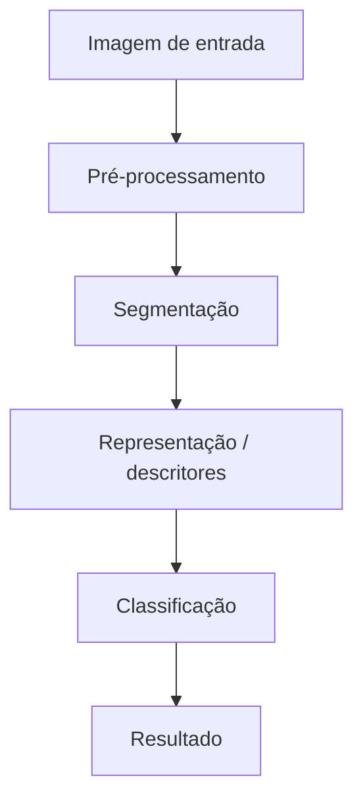

# Proposta do Projeto - Identificação e Contagem de Moedas

**Equipe:** Gabriel Maximiano dos Santos, Diego Augusto Carvalho, Seiki Takao Iizuka  
**Disciplina:** Processamento de Imagens  

---

## 1. Problema
A identificação e contagem manual de moedas em estabelecimentos comerciais ou no uso doméstico é uma atividade repetitiva, demorada e sujeita a erros, especialmente ao lidar com grandes volumes de moedas e na ausência de contadores digitais físicos.

Este projeto propõe investigar esse problema utilizando o processamento digital de imagens (PDI). A situação inicial consiste em uma foto contendo um conjunto de moedas (Real) espalhadas sobre uma superfície qualquer. A partir dessa imagem, deve-se produzir a localização (segmentação) de cada moeda, a classificação do seu respectivo valor e o somatório final.

---

## 2. Contexto de Aplicação
A solução é destinada principalmente a pequenos comerciantes que não possuem dispositivos específico para contagem de moedas, além do uso doméstico. Servirá como uma ferramenta de auxílio rápido, onde o usuário pode tirar uma foto das moedas e visualizar o valor total.

---

## 3. Objetivos

### 3.1 Objetivo Geral
Desenvolver um sistema computacional capaz de segmentar, identificar o valor nominal e contabilizar moedas
do Real em imagens digitais, informando o somatório dos valores.

### 3.2 Objetivos Específicos
- Segmentar as moedas separando-as do fundo da imagem (background);
- Isolar cada moeda (lidando, se possível, com casos de oclusão leve ou moedas muito próximas);
- Classificar o valor de cada moeda detectada;
- Calcular e exibir o montante final

---

## 4. Entrada e Saída Esperadas
- **Entrada:** Uma imagem digital contendo uma ou múltiplas moedas. Para o escopo do projeto, é assumido que todas as moedas presentes na imagem tenham a face "coroa" voltada para cima. além disso, o fundo deve ter uma neutralidade razoável que permita a segmentação e Identificação adequada. 
- **Saída:** Uma texto informando o total do montante detectado.

---

## 5. Critérios de Sucesso
- **Segmentação precisa:** O sistema precisa ser capaz de extrair corretamente a geometria das moedas, delimitando se certa região é uma moeda ou o fundo e, ao mesmo tempo, descartando ruídos e reflexos de fundo que possam interferir negativamente na segmentação. 
- **Precisão na classificação:** O modelo de rede neural deve ser capaz de identificar corretamente o valor das moedas através de sua tipografia, independentemente de sua rotação. 

## 6. Imagens
A

---

## 7. Pipeline Preliminar

### 7.1 Detalhamento das Etapas

1. **Pré-processamento:** Primeiramente,a imagem é convertida para uma escala de cinza (cv2.cvtColor) para diminuir o custo computacional. É aplicado um filtro de convolução gaussiano (cv2.GaussianBlur) para suavizar os detalhes internos da moeda, o que vai ser útil para a segmentação. Depois, é aplicado a binarização de Otso (cv2.THRESH_OTSO) (uma vez que o cv2.findCountours apenas detecta objetos claros num fundo escuro, será feito uma análise dos pixels da borda pada deduzir qual a parte clara e qual a parte escura e, dependendo do caso, será usado o cv2.THRESH_BINARY_INV ou o cv2.THRESH_BINARY. Ainda estamos avaliando essa parte) para criar uma máscara matemática que separa o fundo das moedas. 

2. **Segmentação:** É usado o algoritmo de suzuki (cv2.findCountours) para varrer a máscara para buscar fronteiras externas e fechadas. É usado o cv2.contourArea para descartar contornos muito pequenos, como poeira e reflexos. 

3. **Representação/descritores:** Para cada moeda/contorno encontrada, o sistema delimita uma caixa ao redor dela (cv2.boundingRect). Uma vez que as moedas são de tamanhos diferentes, cada caixa será redimensionada, através de interpolação espacial, para um tamanho fixo e padrão. Após isso, os valores das cores do pixels são normalizados para uma escala de 0.0 a 1.0, antes de serem convertidos pada tensores de entrada para que a rede neural possa trabalhar com a imagem. 

4. **Classificação (TensorFlow/Keras):**  O tensor será injetado em uma rede neural convolucional. O modelo irá analisar características da tipografia independentemente da orientação da moeda (será usada a técnica de data augmentation), gerando a probabilidade da classe através da função softmax. 

5. **Resultado:** Após a identificação, o valor nominal correspondente é incrementado em uma variável que representa o valor do montante.

--- 

## 8. Arquitetura preliminar
A

---

## 9. Estudo Inicial de Viabilidade
A

---

## 10. Uso de Inteligência Artificial Generativa
A
