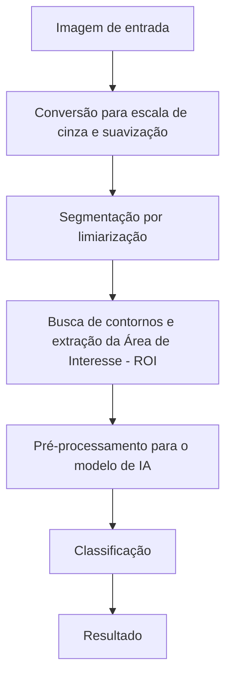

# Proposta do Projeto - Identificação e Contagem de Moedas

**Equipe:** Gabriel Maximiano dos Santos, Diego Augusto Carvalho, Seiki Takao Iizuka  
**Disciplina:** Processamento de Imagens  

---

## 1. Problema
A identificação e contagem manual de moedas em estabelecimentos comerciais ou no uso doméstico é uma atividade repetitiva, demorada e sujeita a erros, especialmente ao lidar com grandes volumes de moedas e na ausência de contadores digitais físicos.

Este projeto propõe investigar esse problema utilizando o processamento digital de imagens (PDI). A situação inicial consiste em uma foto contendo um conjunto de moedas (Real) espalhadas sobre uma superfície qualquer. A partir dessa imagem, deve-se produzir a localização (segmentação) de cada moeda, a classificação do seu respectivo valor e o somatório final.

---

## 2. Contexto de Aplicação
A solução é destinada principalmente a pequenos comerciantes que não possuem dispositivos específico para contagem de moedas, além do uso doméstico. Servirá como uma ferramenta de auxílio rápido, onde o usuário pode tirar uma foto das moedas e visualizar o valor total.

---

## 3. Objetivos

### 3.1 Objetivo Geral
Desenvolver um sistema computacional capaz de segmentar, identificar o valor nominal e contabilizar moedas
do Real em imagens digitais, informando o somatório dos valores.

### 3.2 Objetivos Específicos
- Segmentar as moedas separando-as do fundo da imagem (background);
- Isolar cada moeda (lidando, se possível, com casos de oclusão leve ou moedas muito próximas);
- Classificar o valor de cada moeda detectada;
- Calcular e exibir o montante final

---

## 4. Entrada e Saída Esperadas
- **Entrada:** Uma imagem digital contendo uma ou múltiplas moedas. Para o escopo do projeto, é assumido que todas as moedas presentes na imagem tenham a face "coroa" voltada para cima. além disso, o fundo deve ter uma neutralidade razoável que permita a segmentação e Identificação adequada. 
- **Saída:** Um texto informando o total do montante detectado.

---

## 5. Critérios de Sucesso
- **Segmentação precisa:** O sistema precisa ser capaz de extrair corretamente a geometria das moedas, delimitando se certa região é uma moeda ou o fundo e, ao mesmo tempo, descartando ruídos e reflexos de fundo que possam interferir negativamente na segmentação. 
- **Precisão na classificação:** O modelo de rede neural deve ser capaz de identificar corretamente o valor das moedas através de sua tipografia, independentemente de sua rotação. 

## 6. Imagens
A

---

## 7. Pipeline Preliminar

### 7.1 Detalhamento das Etapas

1. **Conversão para escala de cinza e suavização** 
- **Finalidade:** Converter a imagem para uma escala de cinza para reduzir custo computacional e borrar a imagem para para suavizar os detalhes internos da moeda, o que vai ser útil para a segmentação. 
- **Técnica:** Para fazer a conversão para escalas de cinza, será usado a técnica de 'conversão de espaços de cores' através de 'cv2.cvtColor'. Para o filtro de suavização, será aplicado uma convolução gaussiana (cv2.GaussianBlur).  
- **Recebe:** Imagem original colorida (BGR). 
- **Produz:** Matriz bidimensional em tons de cinza com suavização espacial.  
- **Principal dúvida:** Ainda não sabemos o tamanho ideal da máscara/kernel de convolução gaussiana para aplicar na imagem sem prejudicar muito a nitidez das bordas. 

2. **Segmentação por limiarização** 
- **Finalidade:** Separar matematicamente as moedas do fundo, binarizando a imagem.  
- **Técnica:** Através do 'cv2.threshold', será utilizado o método de limiarização global usando o método de Otsu (cv2.THRESH_OTSU). 
- **Recebe:** Matriz bidimensional em tons de cinza com suavização espacial.  
- **Produz:** Máscara binária que separa o fundo das moedas.  
- **Principal dúvida/Observação:** uma vez que o cv2.findCountours apenas detecta objetos claros num fundo escuro, será feito uma análise dos pixels da borda para deduzir qual a parte clara e qual a parte escura e, dependendo do caso, será usado o cv2.THRESH_BINARY_INV ou o cv2.THRESH_BINARY. Ainda estamos avaliando essa parte.  

3. **Busca de contornos e Extração da Área de interesse (ROI)** 
- **Finalidade:** Delimitar os limites espaciais de cada moeda na mascára binária e extrair o recorte de cada moeda.  
- **Técnica:** É usado o algoritmo de suzuki (cv2.findCountours) para varrer a máscara para buscar fronteiras externas e fechadas. É usado o cv2.contourArea para descartar contornos muito pequenos, como poeira e reflexos. Para cada moeda/contorno encontrada, o sistema delimita uma caixa ao redor dela (cv2.boundingRect). 
- **Recebe:** Máscara binária 
- **Produz:** Recortes individuais contendo cada moeda encontrada.  
- **Principal dúvida:** Não sabemos exatamente como vamos lidar com partes de outras moedas presentes na borda de um determinado recorte. 

4. **Pré-processamento para o modelo de IA**  
- **Finalidade:** Padronizar cada recorte para que o modelo de IA possa trabalhar.  
- **Técnica:** Uma vez que as moedas são de tamanhos diferentes, cada caixa será redimensionada, através de interpolação espacial, para um tamanho fixo e padrão. Os valores das cores do pixels são normalizados para uma escala de 0.0 a 1.0, antes de serem convertidos pada tensores de entrada para que a rede neural possa trabalhar com a imagem.  
- **Recebe:** Recortes (ROIs) de dimensões variadas. 
- **Produz:** Tensor padronizado. 
- **Principal dúvida:** O quanto o redimensionamento dos recortes vai interferir na acurácia do modelo. 

5. **Classificação** 
- **Finalidade:** Inferir a classe correta de moeda a partir dos padrões visuais da face da coroa.  
- **Técnica:** Rede Neural Convolucional (TensorFlow/Keras). 
- **Recebe:** Tensor padronizado. 
- **Produz:** Array com a distribuição de probabilidades de classes, através da função softmax. 
- **Principal dúvida:** Precisamos decidir em detalhes como será feito o treinamento e outros parâmetros importantes do modelo, como o número de camadas.  

6. **Resultado** 
- **Finalidade:** Identificar qual a moeda correta e incrementar o valor em uma variável que representa montante total.  
- **Técnica:** Uso de lógica interna no código python para decidir qual é a classe com maior probabilidade. 
- **Recebe:** Array com a distribuição de probabilidades de classes, através da função softmax. 
- **Produz:** Incremento na variável do montante total. 

--- 

## 8. Arquitetura preliminar
A arquitetura do software é dividida em três partes principais: 

**Visão computacional (OpenCV):** Responsável por abrir a imagem, aplicar os filtros necessários, achar os contornos e fazer os recortes necessários. 

**Módulo matemático (Numpy):** redimensiona os valores dos canais dos pixels para valores de 0 a 1 e faz a "criação" dos tensores que vão ser usados pelo modelo.

**Módulo de IA (TensorFlow+Keras):** Usa as redes neurais para identificar e classificar o valor nominal das moedas. 

---

## 9. Estudo Inicial de Viabilidade
É importante salientar que este projeto não se trata de um software inédito. Existem projetos semelhantes que já demostram que a solução é possível. O Estudo inicial de viabilidade se concentrou até agora em dois aspectos do nosso sistema. 

**Segmentação**<b>
O uso de técnicas de limiarização e topologia é uma abordagem consolidada para identificar objetos através do contorno, que no nosso caso será usada para a extração da geometria de moedas através. Um exemplo claro da robustez dessa técnica é encontrado na documentação oficial da biblioteca ViSP, que demonstra a eficácia da limiarização (usando o método de Otsu, o mesmo que será adotado) para criar uma imagem binarizada que separa o fundo das moedas e permite a identificação e contagem de moedas. Dísponível em [https://visp-doc.inria.fr/doxygen/visp-daily/tutorial-imgproc-count-coins.html]

**Reconhecimento**<b>
É amplamente documentado na literatura a eficácia do uso de redes neurais convolucionais para identificar objetos em imagens, incluindo objetos muito mais complexos. Aplicado ao nosso escopo específico, existem provas de conceito Open Source que mostram a capacidade das CNNs em lidar com os padrões visuais do dinheiro brasileiro. O projeto 'Identifying-Brazilian-Coins-with-CNN', disponível em [https://github.com/amyoshino/Identifying-Brazilian-Coins-with-CNN], serve de evidência de que o tipo de modelo proposto consegue aprender e diferenciar as diferentes classes. 

---

## 10. Uso de Inteligência Artificial Generativa
**Ferramenta utilizada: ** Gemini Pro 3.1.<b>
**Finalidade:** Brainstorming de abordagens, técnicas e métodos para o projeto; Pesquisa e aprofundamento em informações necessárias; Refinamento textual. <b>
**Material produzido ou modificado:** Texto descritivo de 'PipeLine preliminar'. Além de refinamentos textuais ao longo da documentação. <b>
**forma como o grupo verificou a resposta obtida** Nenhuma decisão foi aceita cegamente. Qualquer sugestão dada pela IA passou pela validação de alguém do grupo. E qualquer sugestão foi passada por revisão. <b>
